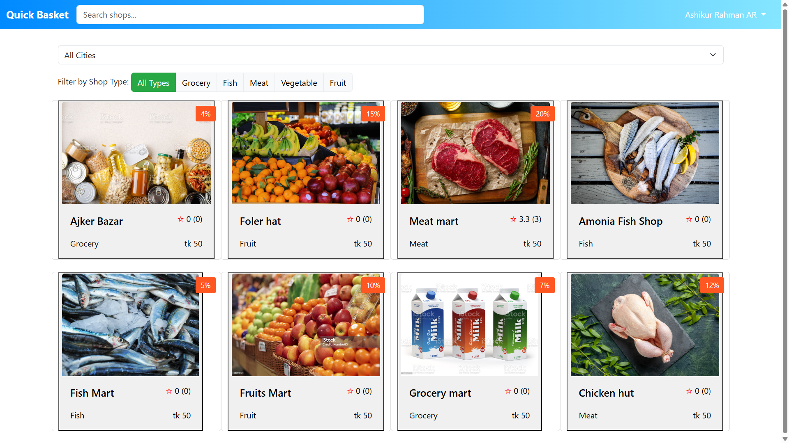
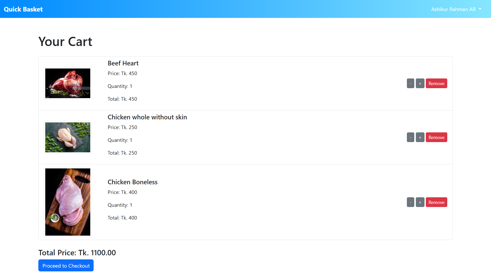
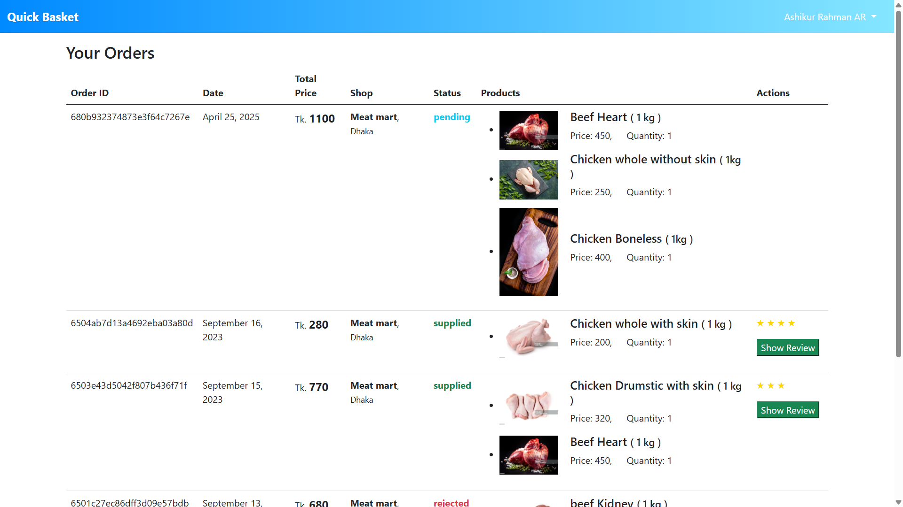
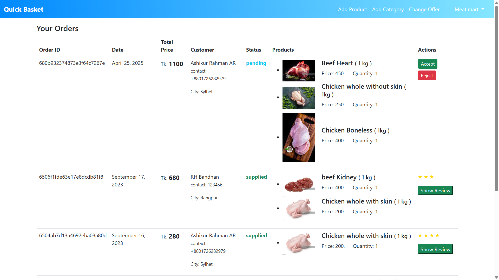
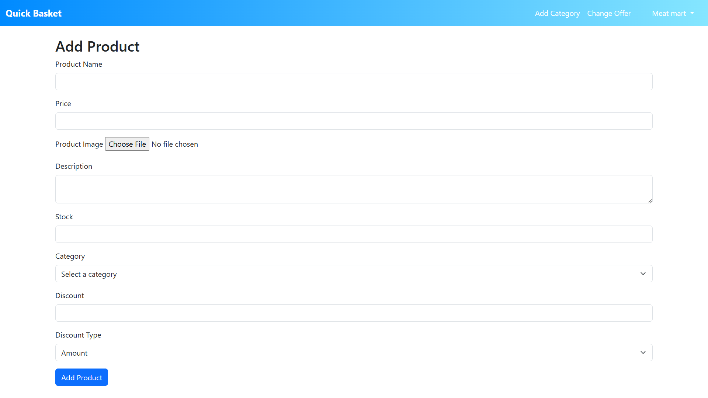
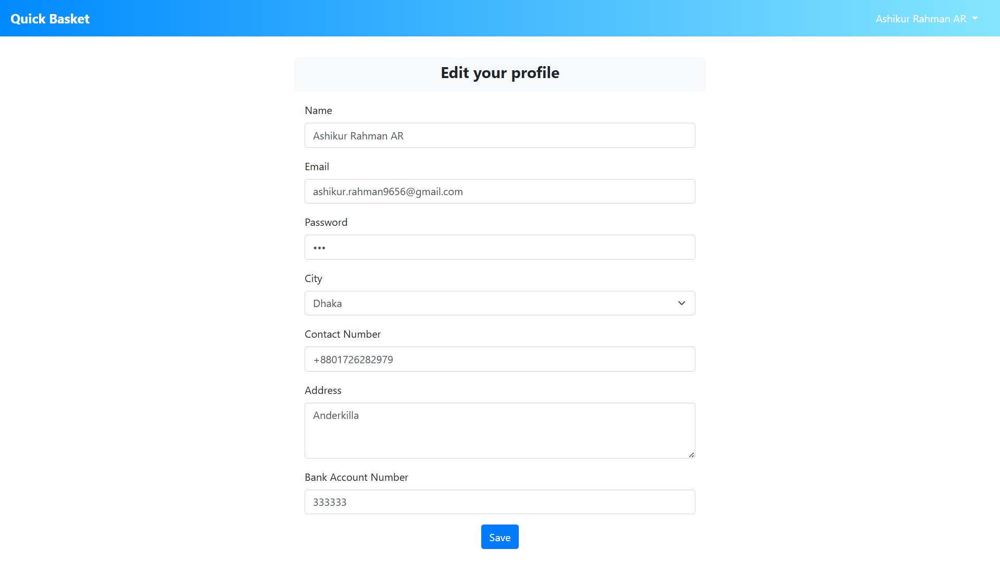

# Quick Basket

Quick Basket is an e-commerce platform that allows users to explore and purchase products from a variety of shops, such as **Fish**, **Meat**, **Vegetables**, **Fruit**, and **Grocery**. The application supports shop filtering by **type** and **city**, ensuring users can find the products they need conveniently. Users can purchase from **one shop at a time**, ensuring a streamlined checkout process.

## Table of Contents

1. [Features](#features)  
2. [Screenshots](#screenshots)  
3. [Technologies Used](#technologies-used)
4. [Usage](#usage)
5. [Installation](#installation)  
 

---

## Features

- Explore five types of shops: **Fish**, **Meat**, **Vegetables**, **Fruit**, and **Grocery**.
- Filter shops by **type** and **city** for easy navigation.
- Purchase from only one shop at a time to streamline checkout.
- Dynamic and interactive UI for a seamless shopping experience.
- Secure data handling using **MongoDB** for backend storage.

---


## **Screenshots**


| Home Screen | Cart | Orders page |
|-------------|-----------------|----------------------------|
|  |  |  |
| Products of a shop | Orders of a Shop | Adding Product |
|  |  |  |
| Adding Product Catagory | Editing Profile | Changing shop offer
|  |  |  

## Technologies Used

- **Frontend:** HTML, CSS, JavaScript  
- **Backend:** Node.js, Express.js  
- **Database:** MongoDB  

---

## Usage

1. Select a shop category from the homepage.
2. Use the filter option to refine results by shop type or city.
3. Browse products and add them to the cart.
4. Proceed to checkout and place your order.


## Installation

1. **Clone the repository**:  
   ```bash
   git clone https://github.com/AshikurRahman3/quick-basket.git


2. **Install dependencies**

    Go to project root folder
    ```bash
    npm install

3. **Run the Application**
    ```bash
    npm start

4. **Go to Website**

    [localhost:3000](http://localhost:3000)


## **Developer**

Developed by [Ashikur Rahman](https://github.com/AshikurRahman3).  
Feel free to explore my other projects on GitHub!

